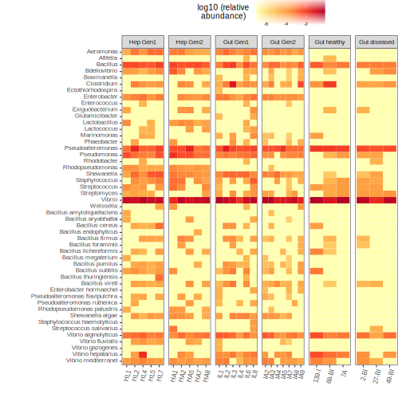
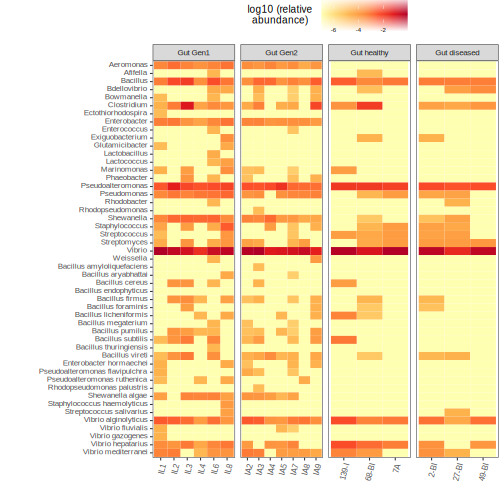
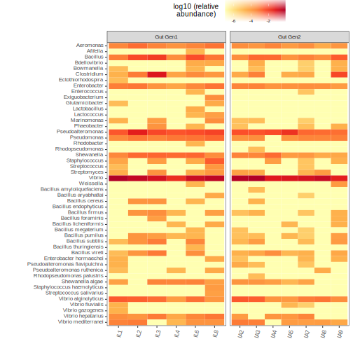
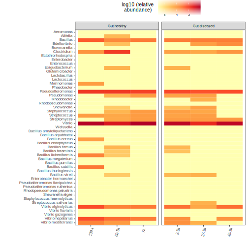
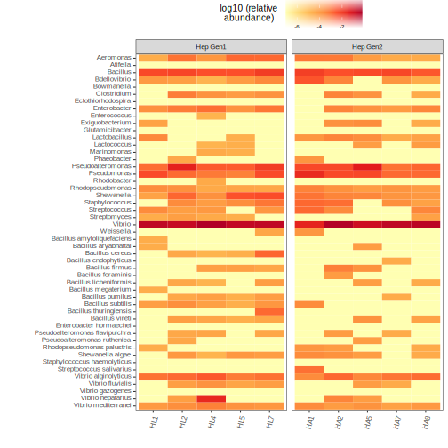

## All samples

## All guts

## Gut probiotics

|taxa|p-value|Genetic 1|Genetic 2|
|-|-|-|-|
|D_5__Aeromonas|0.022144522144522|0.0006315017|0.0002058051|
|D_5__Pseudomonas|0.013986013986014|0.0008189643|0.0002800569|
|D_5__Shewanella|0.034965034965035|0.0011675993|0.0003690849|

## Health status probiotics

**No hay diferencias sifnificativas en ningun probiótico**

## Hep probiotics

|taxa|p-value|Genetic 1|Genetic 2|
|-|-|-|-|
|D_6__Bacillus_cereus|0.025369859822054|0.0002969912|0.0000000000|

