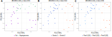
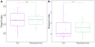
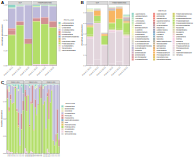
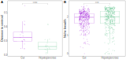
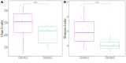
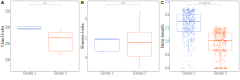
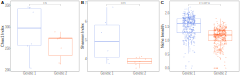
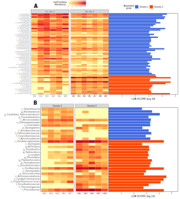

#### Figure 2: Beta diversity (unweighted UniFrac) comparing between A) organs, B) genetics and C) ponds.

#### Figure 3: Alpha diversity contrasting gut and hepatopancreas samples; A) Chao1 and B) Shannon.

#### Figure 4: Taxonomy (>0.01%) at A) phylum level and B) genus level clustered by organ and pond.

#### Figure 5: A) Niche breadth between organs, B) distance to centroid of beta diversity between organs; alpha diversity contrasting genetics C) Chao 1 and D) Shannon.

#### Alpha diversity contrasting genetics (both organs, Mazatlan and Lajitas) C) Chao 1 and D) Shannon.

#### Figure 6: Alpha diversity and niche breadth contrasting genetics between hepatopancreas samples; A) Chao1 and B) Shannon and C) niche breadth.

#### Alpha diversity and niche breadth contrasting genetics between gut samples; A) Chao1 and B) Shannon and C) niche breadth.

#### Figure 7: A)  LEfSe analysis of hepatopancreas samples between genetics with a heatmap contrasting the relative abundance of the differentially abundant taxa and its LDA score; B) LEfSe analysis of gut samples between genetics with a heatmap contrastins the relative abundance of the differentially abundant taxa and its LDA score.

