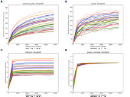
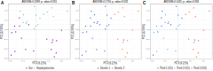
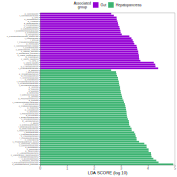
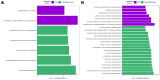
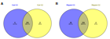
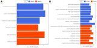
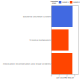

####  Supplementary figure 1: Rarefaction curves with all samples. A) Observed OTUs, B) Chao1, C) Shannon and D) Goods Coverage.

#### Supplementary figure 2: Beta diversity (Jaccard) comparing between A) organ, B) genetics and C) ponds.

#### Supplementary figure 3: LEfSe of taxonomical classification contrasting gut and hepatopancreas samples.

#### Supplementary figure 4: LEfSe of PICRUSt predicted functions contrasting gut and hepatopancreas samples. A) KEGG level 2 and B) KEGG level 3.

#### Supplementary figure 5: Venn diagrams of shared OTUs contrasting genetics in A) gut and B) hepatopancreas samples.

#### Supplementary figure 6: LEfSe of PICRUSt predicted functions contrasting gut samples between genetics. A) KEGG level 2 and B) KEGG level 3.

#### LEfSe of PICRUSt predicted functions contrasting hepatopancreas samples between genetics with KEGG level 3 classification.

